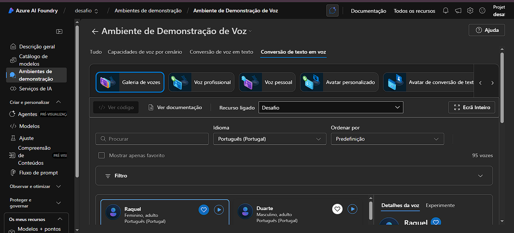
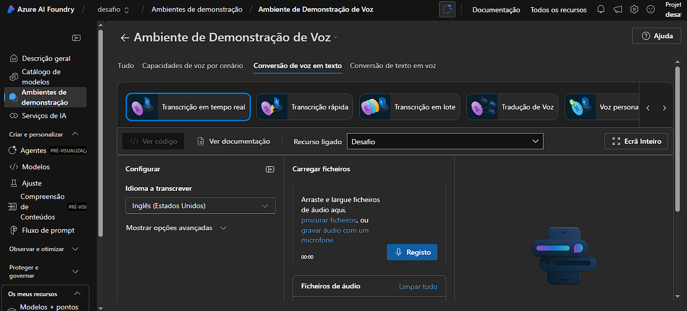

# 🎙️ Desafio de Voz e Linguagem - DIO

## 🧠 Objetivo
Explorar os recursos do **Azure Speech Studio (Voz)** e do **Language Studio (Linguagem)**, praticando ferramentas de inteligência artificial para análise de fala e texto.

Este desafio faz parte da formação de IA da **Digital Innovation One (DIO)**.

---

## 🗣️ Parte 1 - Azure Speech (Voz)
- Criei um recurso do tipo **Speech Services** no Azure, chamado `desafio`.
- Acedi ao **Azure AI Foundry**, onde explorei o ambiente de demonstração de Voz.
- Entendi que este recurso pode ser usado para:
  - **Conversão de texto em voz (Text-to-Speech)**  
  - **Reconhecimento de fala (Speech-to-Text)**  
  - **Tradução de voz**
- Insight: o laboratório atual mostra um ambiente de demonstração, mas o recurso está pronto para uso via API em aplicações reais.

📸 *Exemplo de conversão de texto em voz:*

📸 *Exemplo de reconhecimento de fala:*

---

## 💬 Parte 2 - Language Studio
- Criei um recurso de **Language Service** no Azure (`desafiolinguagem`).
- Acedi ao **Language Studio** e escolhi o recurso.
- Usei a funcionalidade **“Analisar Sentimentos e Opiniões”**.
- Frase usada:  
  > "Adoro estudar inteligência artificial, mas às vezes fico cansada."
- Resultado: sentimento **misto** (positivo e negativo).
- Insight: o serviço identifica o tom geral de um texto e é útil para análise de feedback, atendimento automático e chatbots.

📸 *Resultado do teste no Language Studio:*

---

## 📘 Conclusão
Este desafio permitiu compreender como os serviços de **Voz e Linguagem da Azure** funcionam na prática.  
Ambos podem ser integrados em aplicações para oferecer reconhecimento de fala, síntese de voz e análise de sentimentos em texto.

---

## 🔗 Recursos Úteis
- [Azure Speech Studio](https://speech.microsoft.c)
